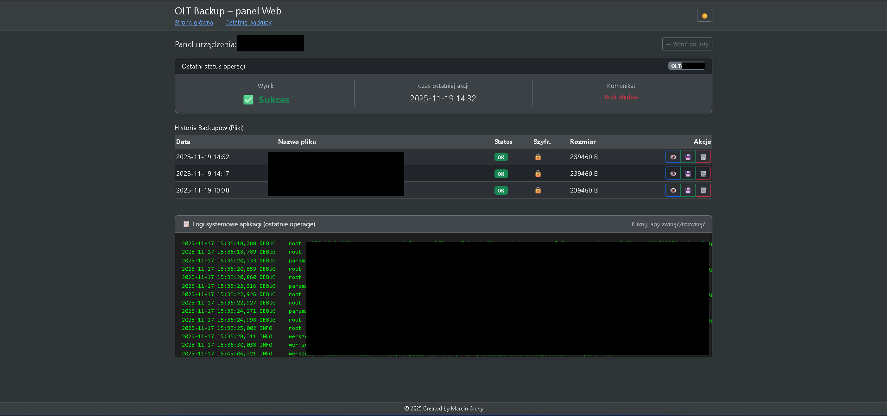
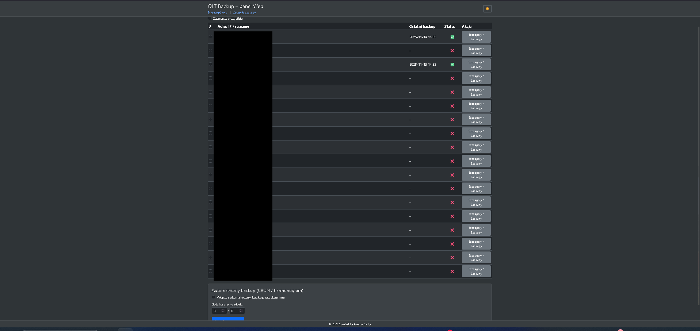

# OLT Backup & Management System

Profesjonalne narzędzie do automatyzacji backupów urządzeń sieciowych (OLT) z interfejsem Web, szyfrowaniem danych i obsługą bazy danych.

## 📸 Zrzuty ekranu





---

## 🚀 Główne funkcjonalności

* **Automatyzacja:** Backup konfiguracji urządzeń po SSH (Huawei/HP/ZTE i inne kompatybilne).
* **Bezpieczeństwo:**
    * Szyfrowanie plików backupu na dysku (AES/Fernet).
    * System logowania i sesji (Flask-Login).
    * Brak haseł w jawnym tekście.
* **Baza Danych:** Obsługa SQLite (domyślnie) oraz PostgreSQL (produkcyjnie).
* **Interfejs Web:**
    * Lista urządzeń ze statusami na żywo.
    * Szczegółowa historia operacji.
    * Podgląd i pobieranie (odszyfrowanych w locie) plików.
    * Podgląd surowych logów systemowych.
    * Obsługa trybu Ciemnego i Jasnego.
* **Wielowątkowość:** Wykonywanie backupów w tle z blokadą współbieżności.

## 🛠️ Instalacja i Uruchomienie

### Wymagania
* Python 3.11+
* Zalecane środowisko wirtualne (venv)

### 1. Konfiguracja środowiska

```
# Utwórz i aktywuj venv
python -m venv .venv
# Windows:
.\.venv\Scripts\Activate.ps1
# Linux:
source .venv/bin/activate

# Zainstaluj zależności
pip install -r requirements.txt
```

### 2. Konfiguracja pliku .env

Utwórz plik .env na podstawie poniższego wzoru. Ważne: Wygeneruj własny klucz szyfrowania!
Ini, TOML

#### Baza danych (sqlite lub postgres)
    DB_TYPE=sqlite
    DATA_DIR=.

#### Bezpieczeństwo
    SECRET_KEY=losowy_ciag_znakow_dla_flask_sesji
#### Wygeneruj klucz poleceniem: python -c "from cryptography.fernet import Fernet; print(Fernet.generate_key().decode())"
    BACKUP_ENCRYPTION_KEY=TWOJ_WYGENEROWANY_KLUCZ_BASE64=

#### Dane logowania do urządzeń OLT
    SSH_USERNAME=admin
    SSH_PASSWORD=moje_tajne_haslo
    SSH_TIMEOUT=20

#### Pliki
    DEVICES_FILE=devices.txt
    BACKUP_DIR=backups

### 3. Pierwsze uruchomienie

Przed startem serwera należy zainicjować bazę danych i utworzyć użytkownika.


### Inicjalizacja tabel
    python -m flask --app webapp init-db

#### Import urządzeń z pliku devices.txt (opcjonalnie)
    python -m flask --app webapp import-devices

#### Utworzenie administratora
    python -m flask --app webapp create-user admin MojeHaslo123

### 4. Start aplikacji

```
python -m flask --app webapp run --host=0.0.0.0
```
Aplikacja będzie dostępna pod adresem: http://localhost:5000

## 🐳 Docker

Aplikacja jest przygotowana do pracy w kontenerze. Należy zamontować wolumen na katalog /data, aby zachować bazę danych SQLite oraz zaszyfrowane pliki backupów.

Wymagane zmienne środowiskowe w kontenerze to m.in.: BACKUP_ENCRYPTION_KEY, SSH_USERNAME, SSH_PASSWORD.

### 🔒 Bezpieczeństwo

    Pliki backupów są zapisywane na dysku w formie zaszyfrowanej.

    Klucz szyfrowania (BACKUP_ENCRYPTION_KEY) nie może zostać zgubiony – bez niego odzyskanie backupów jest niemożliwe.

    Sesja użytkownika wygasa automatycznie po restarcie aplikacji lub po 30 minutach bezczynności.

### © 2025 OLT Backup Project by Marcin Cichy